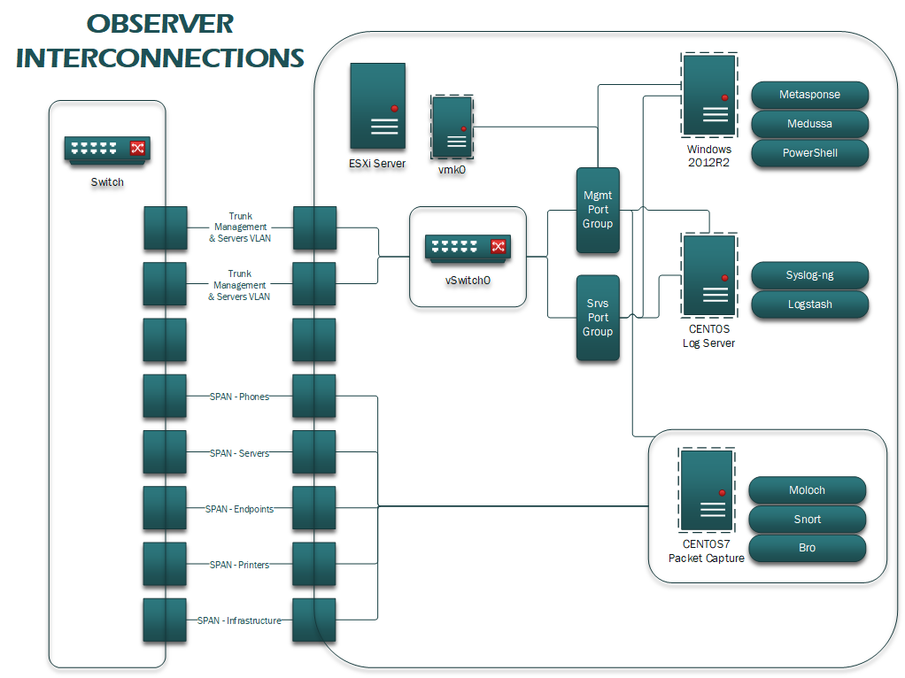

# Observer




## Recommended Hardware Setup
  - Dell PowerEdge R610 (Current model in testing)
  - 96GB RAM 
  - 750 GB HDD Space
    - 2x 75GB
    - 4x 150GB
  - 7 physical NICs (depending on what segregated traffic will be monitored)
    
[ONLY 2 LOCAL SPAN SESSIONS - NEEDS TO BE UPDATED!]    
  
## Server
  - Raid Setup
    - Volume 1 (system) Create the first volume in a RAID1 configuration using the two 75GB HDDs.
    - Volume 2 (vms) Create the second volume in a RAID5 configuration using the four 150GB HDDs.
  - NOTE: At this point you may need to use a Windows installation disc to reformat Volume 1, since ESXi doesn't support a RAID1 configuration very well.
  - Install ESXi 6.7.u1 onto Volume 1
  
### ESXi Management
  - vSwitch0
    - Create a new port-group and assign it to your management VLAN
    - Create another port-group and assign it to your server VLAN
  - Set NICs 1-5 in Passthrough Mode 

## Network Configuration
For the rest of the instructions we will be using the following placeholders:
   - Management VLAN: 10
   - Server VLAN: 20 **This should be an existing server VLAN within your network
   - Native Trunking VLAN: 999

On the Switch/Router
   - On the Layer 3 Switch or Router create the internal VLAN and VLAN interface for the esxi managment network.
      ```
      RTR(config)#interface Vlan 10 
      RTR(config-if)#description ESXI Management
      RTR(config-if)#ip address x.x.x.x
      ```
      
   - Configure the trunk port using 2 of the available NICs on the ESXi Server
      ```
      RTR(config)#interface [port#/#]
      RTR(config-if)#description Observer
      RTR(config-if)#switchport
      RTR(config-if)#switchport mode trunk
      RTR(config-if)#switchport trunk native vlan 999
      RTR(config-if)#switchport trunk allowed vlan 10
      RTR(config-if)#switchport trunk allowed add vlan 20
      ```
      
   - Configure the spans for each of the necessary VLANs, respectfully Infrastructure, Servers, Clients, Printers/Peripherals, Phones.
      ```
      RTR(config)#monitor session 1 source vlan [VLANs]
      RTR(config)#monitor session 1 destination interface [G#/#]
      
      RTR(config-if)#description Observer Monitor Port
      RTR(config-if)#switchport
      RTR(config-if)#switchport mode dynamic auto
      ```

## VM Configuration
### CENTOS - Packet Capture & Network Analysis

CENTOS 07 - specs
- CPU: 16 core
- RAM: 32-64 GB
- HD: 100GB
  - / 80gb, /home 15gb, 

From base load you need to run the following:
    ```
    sudo yum update
    sudo yum upgrade
    sudo yum install java
    sudo yum install nfsutils
    #modify firewall for moloch and shipping to elasticsearch
    firewall-cmd --permanent --add-port 8005/tcp #moloch
    firewall-cmd --permanent --add-port 9200/tcp #elastic
    firewall-cmd --reload
    ```
If you have an NFS archive setup on the mothersip then follow these instructions to mount.
  First on the services VM that is hosting the NFS share do the following to add the nfs client:
  ```
  
  ```
Then install moloch package for centos 7 from this location
    ```
    https://molo.ch/#downloads
    yum localinstall moloch-1.X.X-1.x86_64.rpm
    ```
After instalation the /data file will house the moloch files at root. 
    ```
    cd /data/moloch
    cat README
    ```
Follow instructions on read me with the following details:
  - using an external elasticsearch instance and provide one of the nodes for ingesting of data
  - provide passthru nic's for monitoring interface
  - allow for the download of the database files for ip and geoip.  If you are doing an offline install skip this step but be sure to      download these files and then unpack in the /data/moloch/bin folder before starting the capture service
  - follow instructions for new build if this is the first observer on this node, otherwise use update instructions
  
Once setup is complete:
    ```
    sudo systemctl enable molochcapture
    sudo systemctl start molochcapture
    sudo systemctl start molochviewer
    ```
Verify both services started and login to molochviewer at http://xxx.xxx.xxx.xxx:8005  using the admin un/pw just created.


